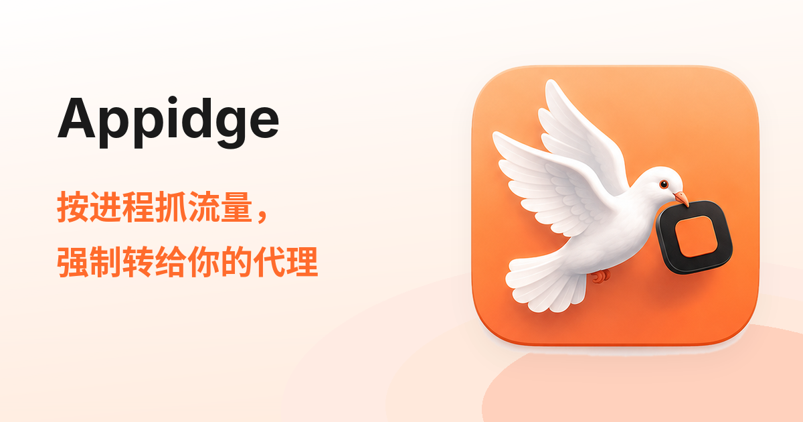

<p align="center">
  
</p>

<p align="center">
  <strong>全局代理开着，Claude、Docker、pip 照样连不上？Appidge 在 macOS 网络层按进程接管流量，强制转给你自己的代理。</strong>
</p>

<p align="center">
  <a href="https://appidge.com">官网</a> •
  <a href="#workflow">工作流程</a> •
  <a href="#quick-start">快速开始</a> •
  <a href="#release">环境与发布</a> •
  <a href="#architecture">架构</a> •
  <a href="#docs">关键文档</a>
</p>

<p align="center">
  
  
  
  
  
  
</p>

很多软件从不读 macOS 系统代理设置——自带网络栈的客户端、pip/npm/Go 工具链、Docker 等后台进程。Appidge 用 Network Extension 在系统网络层接管进程流量，按用户规则决定每个进程的每条连接走**直连**、**上游代理**（单台/代理链/故障转移/负载均衡）还是**拦截**，让它们的流量也归你的规则管。

官网：<https://appidge.com> · 商业闭源，本仓库为私有 monorepo。

## 核心亮点

* **全接管、不断网**：基于 `NETransparentProxyProvider` 透明代理（非 TUN），不改路由表/DNS；崩溃时 fail-open，不会把系统网络变成黑洞。
* **进程 × 主机 × 端口规则**：按进程签名标识 + 目标主机 glob + 端口区间匹配，动作为直连 / 走代理 / 拦截；每条规则可指定走哪台代理，较新的相同规则覆盖旧规则，即时生效。
* **接你自己的上游**：支持 SOCKS5（含 RFC 1929 认证）与 HTTP CONNECT，可组合代理链、故障转移、负载均衡；尽量让 DNS 在代理端解析，避免本地明文 DNS 泄漏。
* **防转发环**：自动识别并放行本地代理软件（Clash/Surge/xray 等）自身流量，「来源即上游」确定性环判定单条 flow 即报；检测到他方 TUN 虚拟网卡时警示冲突。
* **UDP/QUIC 可控**：走代理的进程 UDP 默认拦截（逼 QUIC 回落 TCP，不泄漏），可改为直连，或上游是 SOCKS5 时经 UDP ASSOCIATE 真正代理。
* **不提供节点**：流量出口永远是用户自己配置的上游，转发只发生在本机。

<a id="workflow"></a>
## 工作流程：从「连不上」到「按规则走」

所有进程的连接先过 Appidge 的规则引擎——应用认不认系统代理，都得走这一道：

<table width="100%">
  <tr>
    <td width="50%" align="center">
      <b>1. 配置上游代理</b><br>
      <sub>在「代理」页添加本地 Clash/Surge 端口或远程 SOCKS5 / HTTP 代理，选单台、代理链、故障转移或负载均衡</sub>
    </td>
    <td width="50%" align="center">
      <b>2. 按进程接管流量</b><br>
      <sub>启用系统扩展后接管进程连接；配置过代理时默认走代理，代理软件自身流量自动放行</sub>
    </td>
  </tr>
  <tr>
    <td width="50%" align="center">
      <b>3. 按目标地判定</b><br>
      <sub>规则表从上到下首个命中生效：某些域名走代理，内网、镜像源直连，不想要的直接拦截</sub>
    </td>
    <td width="50%" align="center">
      <b>4. 活动页当场改规则</b><br>
      <sub>实时看到每个被接管的进程与连接，点一下或右键就能改它的走向，马上生效</sub>
    </td>
  </tr>
</table>

<a id="quick-start"></a>
## 快速开始

开发命令**不需要任何云凭证**：

- **API 默认 mock**：`pnpm dev:api` 默认 `MOCK_MODE=true`，不触真实 Creem。
- **秘密最小化**：Web/API 开发不读 Apple 签名 `.env`，原生构建不读 Cloudflare/Creem secret。
- **普通 Debug build 不需要签名配置**。

前置：Node ≥ 22、pnpm ≥ 10（`packageManager` 锁定 `pnpm@10.13.1`）、Xcode 16（Swift 6 toolchain）、XcodeGen。

### Web / API（pnpm + Turborepo）

```bash
pnpm install --frozen-lockfile   # Web/API workspace
pnpm dev:web                     # Astro 官网 dev server
pnpm dev:api                     # wrangler dev（默认 MOCK_MODE=true）
pnpm check                       # lint + typecheck + test + build（web/api）
```

### macOS App / Network Extension

```bash
pnpm check:swift                 # 五个 Swift package tests
xcodebuild -project appidge.xcodeproj -scheme App -configuration Debug build
```

> **提示**：macOS 工程由 XcodeGen 生成。改了 `project.yml` 或增删源文件后跑 `xcodegen generate` 并提交 `project.pbxproj`。做签名/公证构建才需要根 `.env`（模板 `.env.example`）+ `./scripts/gen-signing-xcconfig.sh`。

> **质量闸门**：Swift 6 并发零 warning、SwiftLint strict、五包测试全绿、`pnpm check` 全绿；TDD 约定与完整闸门见 [`CLAUDE.md`](./CLAUDE.md)。

<a id="release"></a>
<details>
<summary><b>环境与发布（点击展开）</b></summary>

<br>

### 1. 双环境拓扑

双环境全部跑在 Cloudflare Free；矩阵单一真相源 `ops/environments/*.conf`，发布唯一入口 `ops/bin/appidge-ops`（详细 runbook：[`ops/README.md`](./ops/README.md)）。

| 组件 | Staging | Production |
|---|---|---|
| Web | staging.appidge.com | appidge.com / www |
| API | api-staging.appidge.com（Creem test） | api.appidge.com（Creem live） |
| Updates | updates-staging.appidge.com | updates.appidge.com |
| D1 | appidge-licensing-staging | appidge-licensing-production |

### 2. 发布命令

```bash
ops/bin/appidge-ops preflight staging          # 本地校验（--remote 加只读远端检查）
ops/bin/appidge-ops plan production            # 打印发布计划，不改任何东西
ops/bin/appidge-ops release staging --apply --build-number <N>   # staging 一键发布（fail-fast）
```

### 3. 发布纪律

- **production 三重保护**：每个远端写命令须同时带 `--apply` + `--confirm-production` + 环境变量 `APPIDGE_PRODUCTION_APPROVED=YES`，缺一 fail-closed；解锁前提清单见 [`docs/prod-launch-checklist.md`](./docs/prod-launch-checklist.md)。
- **build 号**是 staging/production 共用的全局单调序列，`build-macos` 会拉两个 feed 校验；首发 feed 不存在时用一次性开关 `APPIDGE_ALLOW_MISSING_FEED=YES` 放行。
- **系统扩展版本与 app build 解耦**：没改 `Extension/`、`EngineKit`、`IPCContract` 就不 bump；改了必须在 `project.yml` bump `APPIDGE_EXT_BUILD_NUMBER` 并跑 `scripts/check-extension-version.sh --update`，出包闸门对两个方向硬失败。
- **回滚**：Worker 用 `wrangler rollback`/Dashboard 恢复上一 deployment；D1 只前滚（补偿 migration）；macOS 错误包只能发更高 build 修复，不能降号。
- macOS staging/production 共用 Bundle ID 与签名身份，两个包**不能并存**，staging 包只装内部测试机。

</details>

<a id="env-vars"></a>
<details>
<summary><b>环境变量与秘密边界（点击展开）</b></summary>

<br>

### 1. 环境变量

| 位置 | 变量 | 性质 |
|---|---|---|
| `apps/web/.env` | `PUBLIC_SITE_URL` / `PUBLIC_POLAR_CHECKOUT_URL`（历史名，值为 **Creem** 支付链接） / `PUBLIC_API_BASE_URL` / `PUBLIC_DOWNLOAD_URL` | 构建期公开，进静态产物；缺失即 build 失败 |
| `apps/api/.dev.vars`（本地，模板 `.dev.vars.example`） | `MOCK_MODE`、`CREEM_API_KEY`、`CREEM_API_BASE`、`CREEM_PRODUCT_ID`、`CREEM_WEBHOOK_SECRET`、`LICENSE_HMAC_PEPPER` | 本地 secret，git-ignored |
| Cloudflare（线上） | 同上三个 secret 用 `wrangler secret put <NAME> --env <env>` 注入；`MOCK_MODE`/`CREEM_API_BASE`/`CREEM_PRODUCT_ID` 是 `wrangler.toml [env.*.vars]` 公开值 | secret 只存 Worker binding |
| 根 `.env`（模板 `.env.example`） | `TEAM_ID`、`DEVELOPER_ID_APPLICATION`、`PROFILE_APP/EXT`、公证凭证（Apple ID + app 专用密码，或 ASC API key 三件套） | 签名/公证专用，git-ignored，只在 release Mac |
| `ops/environments/*.conf` | 域名、D1 名、公开 checkout 链接等 | 全部公开值，可提交，无 secret |

### 2. 秘密与安全边界

Creem API key、webhook secret、Cloudflare token、Apple/Sparkle 私钥一律不进源码/日志/git：Worker 用 secret binding（本地 `.dev.vars` git-ignored），macOS 签名走 `.env` + `scripts/gen-signing-xcconfig.sh`，客户端只调用 `api.appidge.com`，绝不直连持密上游。

</details>

## 使用方式

* **活动（Activity）**：实时连接表，显示进程、目标、路由与流量；选中一行即可「为这条连接建规则」。
* **应用（Apps）**：按进程查看走法（代理 / 直连 / 放行），被自动旁路的进程标「放行」。
* **规则（Rules）**：进程 × 主机 × 端口的规则表，可启用/停用、指定走哪台代理。
* **代理（Proxies）**：管理上游代理服务器与路由模式（单台 / 代理链 / 故障转移 / 负载均衡）。
* **配置档案（Profiles）**：多套配置快速切换。
* **菜单栏（MenuBarExtra）**：常驻显示活动连接数、实时上下行流量与流量 Top 5 进程，并就地提示扩展通讯中断（一键「重启接管」）、TUN 冲突与疑似转发环；应用内通过 Sparkle 2 自动更新。
* **授权**：首次启动起 7 天免费试用；许可证 US$3.99、可激活 3 台 Mac，经 Creem 结账，密钥存 macOS 钥匙串，14 天无理由退款（以官网定价页为准）。

<a id="architecture"></a>
## 架构

* **Swift 单仓多包**：`Packages/` 下 Core（纯函数 reducer + `@MainActor` Store，单向数据流）、IPCContract（App ↔ Extension 唯一 DTO 契约）、EngineKit（规则匹配、SOCKS5/HTTP CONNECT 客户端、环检测、各类旁路排除）、AppFeature（Effect/持久化/授权客户端）、ArchitectureTests（依赖方向守门）。
* **License facade**：`apps/api` 是 Cloudflare Worker，只暴露 `/healthz` 与 `/v1/licenses/{activate,validate,deactivate}`、`/v1/webhooks/creem`；Creem webhook 用 `creem-signature` HMAC-SHA256 验签 + 事件 ID 幂等登记进 D1；吊销主路是每日 validate，本地 revoked 优先于上游 active。客户端离线宽限默认 7 天，Worker/Creem 临时不可用只进 grace、不误锁。
* **更新链路**：Sparkle 2（只链接进 App target，Extension 不链接），`archive-and-notarize.sh` → `make-dmg.sh` → `generate_appcast` → 发布到 `updates.appidge.com`；系统扩展版本单独钉版，避免每次升级都触发扩展替换竞态。

<details>
<summary><b>仓库布局（点击展开）</b></summary>

<br>

```text
App/ Extension/ Packages/     macOS App、Network Extension、Swift packages（Core/IPCContract/EngineKit/AppFeature/ArchitectureTests）
appidge.xcodeproj project.yml XcodeGen 工程（改 project.yml 后 xcodegen generate）
apps/web                      Astro 静态官网（中/英）
apps/api                      Cloudflare Worker license facade + Creem webhook + D1
contracts/                    licensing.openapi.yaml（App ↔ Worker 唯一契约）+ 脱敏 fixtures
infra/cloudflare              D1 migrations 与部署说明
ops/                          环境矩阵（ops/environments/*.conf）与发布入口（ops/bin/appidge-ops），runbook 见 ops/README.md
scripts/                      签名、公证、DMG、扩展版本闸门
skills/                       可分发的开发经验 skill 快照（NE、macOS 发布、Creem、Cloudflare 免费层）
docs/                         设计与运营文档（见下）
```

</details>

<a id="docs"></a>
## 关键文档

| 文档 | 说明 |
| --- | --- |
| [`CLAUDE.md`](./CLAUDE.md) | 仓库总控：架构边界、并行协作协议、验收标准 |
| [`docs/creem-integration.md`](./docs/creem-integration.md) | **现行** Creem license 集成基线（2026-07 test 模式全链路实测） |
| [`ops/README.md`](./ops/README.md) | staging/production 双环境部署与发布 runbook |
| [`docs/prod-launch-checklist.md`](./docs/prod-launch-checklist.md) | production 上线单一操作清单与剩余人工闸门 |
| [`docs/commercialization-status.md`](./docs/commercialization-status.md) | 商业化阶段历史证据存档（勾选为当时状态） |
| [`docs/polar-integration.md`](./docs/polar-integration.md) | ⚠️ 已废弃（Polar 方案，仅历史参考） |
| [`docs/experience-playbook.md`](./docs/experience-playbook.md) | 开发经验手册：macOS 出包、NE 转发坑、Creem、Cloudflare 免费层（可迁移） |

## 路线图

- [ ] **staging 全链路 smoke**：买单 → activate → validate → 退款 + disable → validate=revoked，通过后做 production 发布审批（`docs/prod-launch-checklist.md` §10）。
- [ ] **release Mac 真机验证**：`build-macos` 签名/公证凭证 + 系统扩展升级 smoke。
- [ ] **live webhook 端到端验证**：向 `api.appidge.com/v1/webhooks/creem` 重投一条事件确认落库。
- [ ] **支付链接变量改名**：`PUBLIC_POLAR_CHECKOUT_URL` 统一改为 `PUBLIC_CHECKOUT_URL`，整条链路（`apps/web` 构建 + `check-site`）一起改（`docs/creem-integration.md` §8）。

## 参与说明

本仓库为私有仓库，仅限受邀协作者。开工前先读 [`CLAUDE.md`](./CLAUDE.md)（开工顺序、文件所有权、TDD 与质量闸门）；push/PR、生产部署、真实退款等改变外部状态的操作需当次明确授权。

## 许可证

商业闭源软件，版权所有，保留一切权利。未经授权不得复制、分发或使用本仓库代码。
