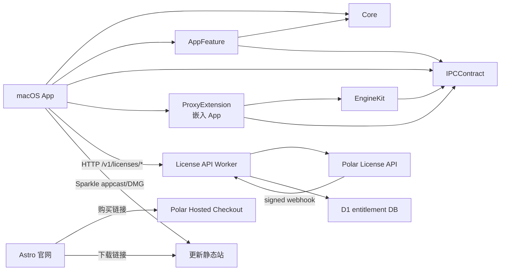

# Appidge 多项目开发、构建与环境发布梳理

> 梳理日期：2026-07-23  
> 基线提交：`3bf9522d219b78984a2569d4cf6c78543b2e7a31`  
> 范围：只分析仓库内现状，不验证 Cloudflare、Polar、Apple Developer 后台的实时状态，不执行部署。

## 1. 结论摘要

Appidge 是一个“同仓库、两套构建系统、四类运行单元”的 monorepo：

1. macOS 主程序和系统扩展：Xcode + Swift Package Manager。
2. 官网：Astro 静态站。
3. License API：Cloudflare Worker + D1，向上游连接 Polar。
4. 更新分发：Cloudflare Workers 静态资源，托管 DMG 和 Sparkle appcast。

当前开发和自动测试体系基本可用；staging 可以通过多条人工命令和本机发布脚本完成，但不是一条完整、可重复、可审计的流水线；production 配置仍有明确占位和环境冲突，当前不应直接执行生产发布。

核心判断如下：

| 问题 | 结论 |
|---|---|
| 多项目关系是否清楚 | 代码边界总体清楚，Swift 包分层也较合理；发布边界和环境边界不够清楚 |
| 本地开发是否可用 | 可用。API 默认 mock，Web 和 Swift 需各自准备本地配置 |
| staging 是否可上线 | 各组件可以人工上线，但没有完整的一键编排；现有 `release-staging.sh` 只发布 macOS 更新，不发布 API、D1 和官网 |
| 能否只改环境变量切换环境 | 不能。Web 公共 URL 和 macOS API URL 可由构建变量切换；路由、D1、Worker secrets、Apple 签名、App Group/XPC、Sparkle 更新资源都不是普通环境变量 |
| staging/prod 能否复用同一制品 | 当前大部分不能。Web 和 macOS 的环境 URL 会编译进制品，需要按环境重建；API 可保持同一代码提交，但部署时仍绑定不同资源 |
| 开发和运维是否已分开 | 尚未。发布秘密、构建、签名、公证、Cloudflare 部署和源代码修改混在个人 Mac 脚本及根 `.env` 中 |
| 脚本是否足够上线 prod | 不足。适合当前维护者手工发布 staging，不足以支撑安全、可回滚、可审计的 production 发布 |

production 前最优先处理：

1. 补齐 API production route、Polar ID、production D1 ID、secrets 和 migration 状态。
2. 将 staging 更新域名从 `updates.appidge.com` 分离；当前 staging 和 production 配置争用同一域名。
3. 明确 staging macOS App 是否需要与 production 并存。当前两者使用同一 bundle ID、App Group、系统扩展 ID 和更新域，不能形成真正隔离。
4. 建立按组件、按环境的部署入口、部署前检查、部署后 smoke、审批和回滚记录。
5. 消除 Xcode 工程双重来源漂移。当前实际 `project.pbxproj` 与 `project.yml` 不一致。

## 2. 仓库中的项目与关系

### 2.1 项目清单

| 项目 | 目录 | 技术/产物 | 运行位置 | 主要职责 |
|---|---|---|---|---|
| macOS App | [`App/`](../App/) | SwiftUI `.app` | 用户 Mac | UI、授权状态、代理控制、Sparkle 更新 |
| ProxyExtension | [`Extension/`](../Extension/) | Network System Extension | 用户 Mac | 透明代理、流量路由 |
| Core | [`Packages/Core`](../Packages/Core/) | Swift library | App | 纯领域状态和 reducer |
| IPCContract | [`Packages/IPCContract`](../Packages/IPCContract/) | Swift library | App + Extension | XPC DTO、协议和服务名 |
| EngineKit | [`Packages/EngineKit`](../Packages/EngineKit/) | Swift library | Extension | 代理引擎与路由能力 |
| AppFeature | [`Packages/AppFeature`](../Packages/AppFeature/) | Swift library | App | effects、持久化、License HTTP/Keychain/XPC 适配 |
| ArchitectureTests | [`Packages/ArchitectureTests`](../Packages/ArchitectureTests/) | Swift test package | CI/本地 | 仓库架构约束测试 |
| 官网 | [`apps/web`](../apps/web/) | Astro 静态 `dist/` | Cloudflare Worker assets | 营销页、购买和下载入口 |
| License API | [`apps/api`](../apps/api/) | TypeScript Worker | Cloudflare Workers | License facade、Polar webhook、D1 entitlement |
| License 契约 | [`contracts`](../contracts/) | OpenAPI + JSON fixtures | 测试/协作边界 | macOS 与 Worker 的跨语言契约 |
| 更新分发 | [`infra/updates`](../infra/updates/) | appcast + DMG 静态资源 | Cloudflare Worker assets | Sparkle 更新和官网下载 |

根 pnpm workspace 只包含 `apps/*`。Swift/Xcode 不受 Turbo 编排，根目录因此不是一个真正统一的 build graph，而是两个并列系统：

- Node：[`package.json`](../package.json) + [`pnpm-workspace.yaml`](../pnpm-workspace.yaml) + [`turbo.json`](../turbo.json)。
- Apple：[`appidge.xcodeproj`](../appidge.xcodeproj/) + Swift Packages。

### 2.2 代码依赖关系



关键边界：

- macOS App 不直接持有 Polar token，只调用自有 API。
- App 和 Extension 通过 `IPCContract` 的 XPC 契约协作。
- 官网是纯静态站，不在浏览器中调用 License API。`PUBLIC_API_BASE_URL` 当前被校验和导出，但页面没有实际使用。
- Polar 购买完成后，通过 webhook 驱动 API/D1 entitlement；License key 激活由 App 调用 API。
- 更新站与 License API 是两个独立 Cloudflare Worker，不应互相代理。

### 2.3 当前源代码真相源

macOS 工程存在两个描述来源：

- 实际构建使用 [`appidge.xcodeproj/project.pbxproj`](../appidge.xcodeproj/project.pbxproj)。
- [`project.yml`](../project.yml) 看起来用于 XcodeGen，但已经落后。

当前可复现差异：

- `project.pbxproj` 的 build number 是 `63`，`project.yml` 仍是 `36`。
- 实际 Xcode 工程包含 Sparkle SPM 依赖，`project.yml` 没有。

因此当前必须把 `appidge.xcodeproj` 当作真实构建来源，不能直接运行 `xcodegen generate`。在修复漂移前，`project.yml` 只能视为历史/辅助描述。

## 3. 当前本地开发方式

### 3.1 统一基础依赖

Node 侧要求：

- Node `>=22`
- pnpm `>=10`
- 仓库锁定 `pnpm@10.13.1`

首次安装：

```bash
pnpm install --frozen-lockfile
```

根命令：

```bash
pnpm dev:web
pnpm dev:api
pnpm lint
pnpm typecheck
pnpm test
pnpm build
pnpm check
pnpm check:swift
```

注意：`pnpm check` 只覆盖 `apps/web` 和 `apps/api`，不覆盖 Swift；Swift 要单独执行 `pnpm check:swift`。两者目前没有统一的本地总闸门命令。

### 3.2 官网开发

配置来源：[`apps/web/.env.example`](../apps/web/.env.example)。

```bash
cp apps/web/.env.example apps/web/.env
# 按本地或 staging 修改四个 PUBLIC_* 公开变量
pnpm dev:web
```

四个变量都是构建期公开配置，会进入静态产物，不能放 secret：

| 变量 | 用途 |
|---|---|
| `PUBLIC_SITE_URL` | canonical、OG、sitemap、robots |
| `PUBLIC_POLAR_CHECKOUT_URL` | 购买 CTA |
| `PUBLIC_API_BASE_URL` | 目前只做必填校验，页面未使用 |
| `PUBLIC_DOWNLOAD_URL` | 下载 CTA |

`PUBLIC_SITE_URL` 缺失时 Astro 配置会立即失败。其余变量由站点配置模块校验 HTTPS 和占位值。

开发和构建：

```bash
pnpm --filter web dev
pnpm --filter web typecheck
pnpm --filter web test
pnpm --filter web build
```

产物：`apps/web/dist/`。

### 3.3 License API 开发

配置来源：[`apps/api/.dev.vars.example`](../apps/api/.dev.vars.example) 和 [`apps/api/wrangler.toml`](../apps/api/wrangler.toml)。

```bash
cp apps/api/.dev.vars.example apps/api/.dev.vars
pnpm dev:api
```

默认 `MOCK_MODE=true`，不访问真实 Polar，适合普通开发。

涉及本地 D1 状态时，先应用 migration：

```bash
cd apps/api
pnpm exec wrangler d1 migrations apply appidge-licensing --local
pnpm dev
```

开发和验证：

```bash
pnpm --filter api lint
pnpm --filter api test
pnpm --filter api build       # wrangler deploy --dry-run
scripts/smoke-license-mock.sh
```

`apps/api` 当前有三条 migration：

1. `0001_init.sql`
2. `0002_polar.sql`
3. `0003_refund_tombstones.sql`

真实 Polar sandbox smoke 是人工入口：

```bash
pnpm --filter api smoke:polar
```

它缺真实 token/license 时会以 `SKIP` 和退出码 0 结束，不应单独作为“sandbox 已验证”的上线证据。

### 3.4 macOS App 与系统扩展开发

本地需要 Apple 签名资料和 provisioning profiles。根 [`.env.example`](../.env.example) 同时包含：

- App/Extension bundle ID。
- App Group。
- Developer ID 签名身份。
- App/Extension profiles。
- Apple 公证凭证。
- 可选的 License 构建 URL。

生成 Xcode 配置：

```bash
cp .env.example .env
# 填写本机真实值
./scripts/gen-signing-xcconfig.sh
open appidge.xcodeproj
```

生成的 `Config/Signing.xcconfig` 被 git ignore，并 include 已提交的 [`Config/AppConfig.xcconfig`](../Config/AppConfig.xcconfig)。

开发构建使用 Xcode 的 `App` scheme；也可以命令行构建：

```bash
xcodebuild -project appidge.xcodeproj \
  -scheme App \
  -configuration Debug \
  -destination 'platform=macOS' \
  build
```

Swift package 测试：

```bash
pnpm check:swift
```

当前开发风险：`Config/AppConfig.xcconfig` 默认是 production API、production 官网和 production 更新域。若开发者没有显式覆盖，Debug App 也可能连接生产服务。API 本地默认 mock，但原生 App 本地并不是默认隔离环境。

系统扩展激活还需要 macOS 人工授权。[`scripts/smoke-ne.sh`](../scripts/smoke-ne.sh) 可以辅助构建、启动和采集日志，但不能代替系统设置中的人工批准。

## 4. 当前构建与打包

### 4.1 官网

输入：

- Git 提交。
- 四个 `PUBLIC_*` 构建变量。

命令：

```bash
pnpm --filter web build
```

输出：`apps/web/dist/`。

环境 URL 已编译进 HTML、sitemap、robots 和链接。因此 staging/prod 需要分别构建，当前不能把完全相同的 `dist/` 从 staging 原样晋级到 production。

### 4.2 License API

本地“build”实际是 Wrangler dry-run：

```bash
pnpm --filter api build
```

部署时 Wrangler 从同一源代码再次构建，并按 `--env staging` 或 `--env production` 绑定不同变量、secrets、D1 和 route。

API 可以保证 staging/prod 使用同一个 Git commit，但当前没有保存并晋级一个独立、不可变 Worker 制品的流程。

### 4.3 macOS `.app`

[`scripts/archive-and-notarize.sh`](../scripts/archive-and-notarize.sh) 负责：

1. 读取根 `.env`。
2. 校验 License API 和购买 URL 必须为 HTTPS。
3. 直接修改 `project.pbxproj`，把 `CURRENT_PROJECT_VERSION` 加一。
4. `xcodebuild archive`。
5. Developer ID `-exportArchive`。
6. zip `.app`，提交 Apple notarization。
7. staple 公证票据。

输出：

- `build/appidge.xcarchive`
- `build/export/appidge.app`
- `build/export/appidge.app.zip`

该脚本显式注入 `LICENSE_API_BASE_URL` 和 `LICENSE_CHECKOUT_URL`，但没有显式注入 `SPARKLE_FEED_URL`；更新 feed 仍依赖当前 `AppConfig.xcconfig`。

脚本每运行一次都会修改被 Git 跟踪的 `project.pbxproj`，即使之后步骤失败也会保留 build number 变化。这使“构建”带有源代码写操作，不适合作为无副作用、可重试的 CI build。

### 4.4 macOS DMG

[`scripts/make-dmg.sh`](../scripts/make-dmg.sh) 负责：

1. 校验 `.app` 已 staple。
2. 制作带 `/Applications` 链接的 DMG。
3. Developer ID 签名。
4. 提交 DMG notarization。
5. staple DMG。

输出：`build/appidge-<short-version>-<build>.dmg`。

### 4.5 Sparkle 更新制品

发布脚本使用 Sparkle `generate_appcast`：

1. 将 DMG 放到 `build/appcast/`。
2. 用登录钥匙串中的 EdDSA 私钥签名。
3. 生成 `appcast.xml`。
4. 复制 appcast、版本 DMG 和 `appidge-latest.dmg` 到 `infra/updates/public/`。

App 内已经有公开 `SUPublicEDKey`。私钥依赖执行发布的个人 Mac 登录钥匙串，没有独立的 CI/release signer 说明或托管流程。

## 5. 当前 staging 上线方式

### 5.1 Git 分支不等于部署

仓库存在 `staging` 分支，审计时它与 `main`、`origin/main`、`origin/staging` 指向同一个提交。

现有 GitHub Actions 只有 CI：

- [`.github/workflows/ci-web.yml`](../.github/workflows/ci-web.yml)
- [`.github/workflows/ci-swift.yml`](../.github/workflows/ci-swift.yml)

没有 workflow 会因为 push `staging` 或 `main` 自动部署。当前 staging 上线完全依赖人工命令；分支只是代码标记，不是环境状态真相源。

### 5.2 API staging

配置已经声明：

- Worker environment：`staging`
- Route：`api-staging.appidge.com`
- `MOCK_MODE=false`
- Polar sandbox API
- staging Polar organization/product/benefit ID
- staging D1：`appidge-licensing-staging`

人工步骤应包括：

1. 确认 staging 的三项 Worker secret 已设置。
2. 对 staging D1 应用全部 migration。
3. `wrangler deploy --env staging`。
4. 验证 `/healthz`、activate/validate/deactivate、webhook。

仓库只有 README 中的部署命令，没有独立的 staging API deploy/preflight/post-deploy 脚本。仓库也不能证明远端 D1 当前是否已经应用 `0003_refund_tombstones.sql`。

### 5.3 官网 staging

部署目标已经声明为 `staging.appidge.com`。

当前人工流程：

```bash
cd apps/web
PUBLIC_SITE_URL=https://staging.appidge.com \
PUBLIC_POLAR_CHECKOUT_URL=<Polar sandbox checkout> \
PUBLIC_API_BASE_URL=https://api-staging.appidge.com \
PUBLIC_DOWNLOAD_URL=<staging download URL> \
pnpm build

../api/node_modules/.bin/wrangler deploy --env staging
```

问题：

- 没有仓库级 deploy script。
- Wrangler 可执行文件借用 `apps/api/node_modules`，组件之间形成了隐式工具依赖。
- 没有部署后完整链接/smoke 验证。
- 当前官网页面不调用 API，所以 `PUBLIC_API_BASE_URL` 并不能验证 App → staging API 的实际链路。

### 5.4 macOS staging 与更新站

[`scripts/release-staging.sh`](../scripts/release-staging.sh) 的真实职责是：

```text
临时重写 AppConfig
→ archive + App notarization
→ DMG + notarization
→ EdDSA appcast
→ 部署 updates Worker
→ 简单 HTTP 验证
→ 成功后还原 AppConfig
```

它不负责：

- API Worker 部署。
- staging D1 migration。
- Worker secrets。
- 官网构建/部署。
- Polar webhook 配置。

脚本当前将 staging App 指向：

- `https://api-staging.appidge.com`
- Polar sandbox checkout redirect
- `https://updates.appidge.com/appcast.xml`

然后将更新 Worker 的 `staging` 环境部署到 `updates.appidge.com`。

这说明当前 staging macOS 发布并不是完整隔离的 staging：

- staging 和 production 更新环境使用同一域名。
- staging 和 production App 使用同一 bundle ID、系统扩展 ID、App Group 和 Sparkle 公钥。
- staging App 不能安全地与 production App 并存，安装/升级可能互相覆盖。
- staging appcast 可能影响任何正在使用同一 feed 的安装。

`finish-release-staging.sh` 是中断后的人工续跑入口，不是事务恢复：前序执行到哪一步仍由操作者判断。

## 6. 环境配置是否能只靠环境变量切换

### 6.1 分组件判断

| 组件 | 环境变量可切换的部分 | 不能只靠环境变量的部分 | 结论 |
|---|---|---|---|
| Web | canonical、checkout、API、download URL | Cloudflare Worker 名称、route；变量会编译进 `dist` | 构建内容基本可以，完整部署不可以 |
| API | mock 开关、Polar base/IDs、限流、body 限制 | Worker route、D1 ID、migrations、Worker secrets | 部分可以 |
| macOS App | License API、购买 URL；理论上也可用 build setting 传 feed | bundle ID、App Group、XPC Mach service、系统扩展 ID、profiles、Developer ID、公证、Sparkle 私钥 | 不可以 |
| Updates | appcast 下载前缀可作为生成参数 | Cloudflare route、签名私钥、已签名 DMG、public 目录、staging/prod 域名所有权 | 不可以 |
| 整套系统 | 可统一传入部分公开 URL | 云资源、身份、秘密、数据库 schema、Apple/Sparkle 信任链 | 不可以 |

### 6.2 macOS 身份不是参数化环境配置

虽然根 `.env` 有 `APP_BUNDLE_ID`、`EXT_BUNDLE_ID`、`APP_GROUP`，但代码和 entitlement 中仍硬编码：

- `group.com.appidge`
- `group.com.appidge.xpc`
- `com.appidge.app`
- `com.appidge.app.ProxyExtension`

涉及文件包括：

- [`App/App.entitlements`](../App/App.entitlements)
- [`Extension/Extension.entitlements`](../Extension/Extension.entitlements)
- [`Extension/Info.plist`](../Extension/Info.plist)
- [`Packages/IPCContract/Sources/IPCContract/XPCTransport.swift`](../Packages/IPCContract/Sources/IPCContract/XPCTransport.swift)
- [`App/SystemExtensionActivator.swift`](../App/SystemExtensionActivator.swift)
- [`App/TransparentProxyController.swift`](../App/TransparentProxyController.swift)

因此仅修改 `.env` 中的 bundle/app group 值，会造成签名配置与运行时标识不一致。若要创建可并存的 staging App，需同步设计：

- staging App/Extension bundle IDs。
- staging App Group entitlement。
- staging XPC Mach service。
- staging provisioning profiles。
- staging 更新 feed。
- staging 安装名和升级策略。

这不是一次普通环境变量替换。

### 6.3 制品晋级能力

当前可以做到的是“同一提交按环境重建”，而不是“同一二进制制品从 staging 晋级 production”：

| 制品 | 能否原样晋级 | 原因 |
|---|---|---|
| Web `dist/` | 否 | 环境 URL 编译进静态产物 |
| API Worker | 部分 | 可使用同一提交，但 Wrangler 会按环境重新构建和绑定资源 |
| macOS App/DMG | 否 | API、checkout、feed 编译进 Info.plist；staging/prod 当前还争用身份与更新域 |
| appcast | 否 | enclosure URL、版本和签名属于具体发布环境 |

若生产要求可审计，应至少保存“源码 commit + 环境清单摘要 + 构建日志 + artifact checksum + 部署 ID”，而不是只记录“运行了哪个脚本”。

## 7. 脚本与 CI 审计

### 7.1 当前覆盖

| 入口 | 当前作用 | 评价 |
|---|---|---|
| 根 `pnpm check` | Web/API lint、typecheck、test、dry-run build | Node 侧清楚，但不含 Swift |
| `scripts/check-swift.sh` | 五个 Swift package test | 清楚；不含完整 App build、签名和系统扩展 |
| `scripts/qa-contract-check.sh` | OpenAPI/fixture 契约测试 | 可发现性好；依赖缺失时 exit 0，不能独立当强制闸门 |
| `scripts/smoke-license-mock.sh` | 本地 Worker+D1+webhook E2E | 覆盖较好；日志仍写只应用到 `0002`，实际已有 `0003` |
| API `smoke:polar` | 真实 Polar sandbox validate | 安全脱敏；缺条件时 SKIP 0，需人工记录证据 |
| `scripts/smoke-ne.sh` | 系统扩展真机辅助验证 | 必然需要人工；硬编码 IDs，仍要求回填已不存在的 `PROGRESS.md` |
| `scripts/gen-signing-xcconfig.sh` | 从 `.env` 生成本机签名配置 | 职责清楚；开发配置与 release secret 共用一个 `.env` |
| `scripts/archive-and-notarize.sh` | App 归档、导出、公证 | 主链路完整；会修改 tracked pbxproj，依赖个人机状态 |
| `scripts/make-dmg.sh` | DMG 构建、签名、公证 | 职责较单一，可用 |
| `scripts/release-staging.sh` | staging App/DMG/appcast/updates 部署 | 名称过宽、范围实际不完整；硬编码机器路径和 checkout；失败会留下源配置变更 |
| `scripts/finish-release-staging.sh` | staging 发布续跑 | 是人工补救脚本，不是自动恢复 |
| `scripts/verify-staging-update.sh` | 已安装 App 与 feed/签名链检查 | 有价值；硬编码 `/Applications`、个人仓库路径和本机钥匙串 |
| `ci-web.yml` | main/PR Web/API CI | 能验证干净 checkout；不部署 |
| `ci-swift.yml` | Swift package test + strict SwiftLint | 不做完整 Xcode App build/archive；不验证 Xcode 工程可签名 |

### 7.2 足够性结论

| 领域 | 评价 |
|---|---|
| 日常代码开发 | 基本足够 |
| 单元/契约测试 | 基本足够 |
| 本地 mock 集成测试 | 较完整 |
| 完整 macOS 构建验证 | 不足，CI 未构建实际 App target |
| staging 单组件人工部署 | 可用但依赖经验 |
| staging 全栈一致发布 | 不足 |
| production 发布 | 不足 |
| 回滚 | API 文档提到 Wrangler rollback；Web、updates、App 没有统一、演练过的回滚入口 |
| 审计与可追溯 | 不足，没有 release manifest、artifact checksum、deployment ID 和审批记录 |
| 多人接手清晰度 | 不足，绝对路径、个人钥匙串、隐式工具路径和历史文档漂移会阻碍接手 |

### 7.3 缺少的运维能力

仓库目前没有：

- 独立的 `deploy-api <env>`。
- 独立的 `migrate-api <env>`，以及 migration 状态检查。
- 独立的 `deploy-web <env>`。
- 独立的 `deploy-updates <env>`。
- 完整的 `release <env>` 编排。
- production preflight。
- 环境资源清单校验。
- 部署后全栈 smoke。
- Web/updates 明确版本回滚。
- GitHub protected environment、人工审批和 production workflow。
- 发布记录、制品 hash、远端 deployment ID。
- secret 存在性检查和轮换演练。
- staging/prod 数据、域名和 macOS 客户端身份隔离说明。

## 8. 当前 production 准备度

### 8.1 阻塞 production 的配置问题

#### API

[`apps/api/wrangler.toml`](../apps/api/wrangler.toml) 的 production 仍有：

- `POLAR_ORGANIZATION_ID` 占位。
- `POLAR_PRODUCT_ID` 占位。
- `POLAR_BENEFIT_ID` 占位。
- production D1 `database_id` 为全 0。
- 没有 production `api.appidge.com` route 配置。

此外必须在 Cloudflare 中单独存在：

- `POLAR_ACCESS_TOKEN`
- `POLAR_WEBHOOK_SECRET`
- `LICENSE_HMAC_PEPPER`

还需确认 production D1 已应用全部三条 migration。仓库不能证明远端状态。

#### Web

production route 已配置为：

- `appidge.com`
- `www.appidge.com`

发布前仍需确定真实：

- `PUBLIC_POLAR_CHECKOUT_URL`
- `PUBLIC_DOWNLOAD_URL`

并保存这次构建实际使用的公开变量摘要。

#### Updates

[`infra/updates/wrangler.jsonc`](../infra/updates/wrangler.jsonc) 已明确暴露当前冲突：

- staging route：`updates.appidge.com`
- production route：`updates.appidge.com`

一个 custom domain 不能同时归属两个 Worker environment。production 前必须先把 staging 迁到独立域名，并重新构建 staging App 使其 feed 指向 staging 更新域。

#### macOS

production URL 默认已经存在，但正式发布仍依赖：

- 正确 Developer ID 和 profiles。
- notarization 凭证。
- Sparkle 私钥。
- 唯一递增 build number。
- App/Extension 签名与 entitlement 验证。
- 旧版本升级到新版本后的系统扩展重绑 smoke。

当前脚本没有 release candidate 冻结、审批、checksum 和发布记录。

### 8.2 文档漂移

现有文档不能直接作为 production runbook：

- [`infra/cloudflare/README.md`](../infra/cloudflare/README.md) 的目标拓扑仍写 Pages/R2，实际配置已经是 Workers 静态资源。
- 同一 README 仍写 staging API `MOCK_MODE=true`，实际 `wrangler.toml` 是 `false` 并连接 Polar sandbox。
- README 只记录到 `0002` migration，实际已有 `0003`。
- [`docs/commercialization-status.md`](commercialization-status.md) 和 [`docs/qa-evidence.md`](qa-evidence.md) 保留了 Creem 迁移期、Sparkle 公钥 TODO 等历史状态，其中部分已不符合当前代码。
- [`docs/sparkle-autoupdate.md`](sparkle-autoupdate.md) 仍将更新托管描述为 R2，实际是 Worker assets。

production 准备应以代码配置和一次新的远端资源盘点为准，不能从旧勾选状态推断线上已经就绪。

## 9. 建议的开发与运维边界

当前不必立即拆成两个 Git 仓库。先在同一仓库中建立明确的责任和接口，通常比马上拆仓风险更低。若之后有合规、权限或组织需求，再将环境清单和 deployment workflow 迁到私有 ops 仓库。

### 9.1 开发负责

- `App/`、`Extension/`、`Packages/`、`apps/*/src`。
- OpenAPI、fixtures、D1 migration 文件。
- 单元测试、契约测试、mock E2E。
- 可重复、无 secret 的构建定义。
- 制品格式和版本规则。
- 服务 health endpoint 和 smoke 能力。
- 每个新 migration 的向前兼容与补偿方案。

开发者不应默认持有：

- production Cloudflare deploy token。
- production Polar token/webhook secret。
- notarization 私钥/API key。
- Sparkle 私钥。
- production D1 写权限。

### 9.2 运维/Release Engineering 负责

- staging/production 资源清单。
- Cloudflare routes、D1 IDs、Worker environments。
- secrets 和权限。
- Apple release signing/notarization 环境。
- Sparkle signer 和更新域。
- 部署审批、执行、观测、回滚。
- production migration 执行和备份/恢复策略。
- release manifest、deployment ID、artifact checksum。
- 线上 webhook、域名和证书状态。

### 9.3 双方接口

每次发布由开发交付：

```text
Git commit/tag
+ changelog
+ migration 列表
+ Web/API/Swift 测试结果
+ macOS version/build
+ 构建所需“非秘密变量”schema
+ 预期 smoke 清单
```

运维返回：

```text
environment
+ 实际部署的 commit/tag
+ 环境清单版本/hash
+ artifact checksum
+ Cloudflare deployment IDs
+ migration applied 状态
+ smoke 结果
+ 审批人/执行人/时间
+ 回滚点
```

### 9.4 配置分层建议

应把配置分为三类，不再全部称为“环境变量”：

1. 公开构建配置：站点 URL、API URL、checkout URL、feed URL。
2. 环境资源配置：Worker route、D1 ID、bundle ID、App Group、profiles、更新域。
3. secrets：Polar token、webhook secret、HMAC pepper、Apple notarization、Sparkle 私钥。

公开配置和非秘密资源 ID 可以版本化；secrets 只保存在 Cloudflare/GitHub/专用 secret manager 或 release signer 中。

根 `.env` 当前同时包含开发签名、release 签名和公证资料，建议在职责上拆开：

- 开发机：只拥有 Debug/Development 所需配置。
- release signer：拥有 Developer ID、notarization 和 Sparkle key。
- Cloudflare deployer：拥有对应环境的最小权限 token。

## 10. 建议的 production 准备顺序

以下是准备顺序，不代表本次已执行。

### 阶段 0：确定环境模型

先决策：

- staging macOS App 是否必须与 production 并存。
- staging 更新域是否采用 `updates-staging.appidge.com`。
- staging 是否继续使用 Polar sandbox，production 使用 Polar live。
- staging/prod 是否分别拥有独立 D1、Worker secrets 和 webhook endpoint。

推荐真正隔离 staging/prod，尤其是 D1、Polar、更新域。若要求两套 macOS App 并存，还需要独立 bundle/App Group/XPC/profiles，不属于简单运维配置。

### 阶段 1：建立环境资源清单

对 staging 和 production 分别记录：

- Web/API/updates 域名和 Worker 名称。
- D1 database name/ID/region。
- Polar organization/product/benefit/checkout/webhook IDs。
- macOS bundle IDs、App Group、profiles。
- Sparkle feed 和公钥指纹。
- secrets 的“存在状态/版本”，不记录 secret 内容。

### 阶段 2：先修复并重新验证 staging

1. 分离 staging updates 域名。
2. 确认 staging D1 已应用 `0001`～`0003`。
3. 部署 API，运行 sandbox smoke。
4. 构建并部署 staging Web。
5. 用 staging feed 重新构建、签名、公证 staging App。
6. 验证购买 → license → activate → refund/revoke。
7. 验证旧版 → 新版 Sparkle + 系统扩展升级。
8. 记录一次可回滚的完整发布证据。

### 阶段 3：补齐 production 资源

1. 创建 production D1，回填真实 ID。
2. 补齐 production Polar IDs。
3. 添加 `api.appidge.com` production route。
4. 注入 production secrets。
5. 配置 production Polar webhook。
6. 验证 Web checkout 和 download URL。
7. 将 `updates.appidge.com` 独占给 production。

### 阶段 4：production 发布

建议顺序：

```text
冻结 commit/tag
→ 全量 CI
→ production preflight
→ D1 migration
→ API deploy + health/license smoke
→ Web build/deploy + link smoke
→ macOS archive/sign/notarize
→ DMG/sign/notarize
→ appcast/sign
→ 上传版本 DMG
→ 最后发布 appcast 与 appidge-latest.dmg
→ Sparkle/安装/授权 smoke
→ 保存 release manifest
```

appcast 应最后发布，避免客户端先看到尚未完整上传或尚未验证的更新。

### 阶段 5：回滚准备

production 发布前应明确：

- API 回滚到哪个 deployment。
- Web/updates 如何恢复上一版本静态资源。
- D1 migration 如何用补偿 migration 前滚修复。
- 已发布 appcast 出错时如何撤回或替换。
- macOS 新版本已经被客户端下载后，如何发布更高 build 的修复版本；不能依赖降级 build number。

## 11. 最终判断

当前仓库已经具备“继续开发并人工发布 staging”的基础，但不具备“只替换一组环境变量即可安全部署任意环境”的能力，也还不具备清晰分权的 production 运维体系。

最合理的下一步不是立刻执行 production deploy，而是先完成：

1. 环境资源和身份模型定稿。
2. staging/prod 更新域隔离。
3. production API/D1/Polar 配置补齐。
4. 按组件拆分发布入口和权限。
5. 用一次完整 staging release 演练生成可复现证据。

完成以上工作后，再把 production 发布变成受审批的运维动作；开发日常只需要提交代码、migration、契约和可验证制品定义。
